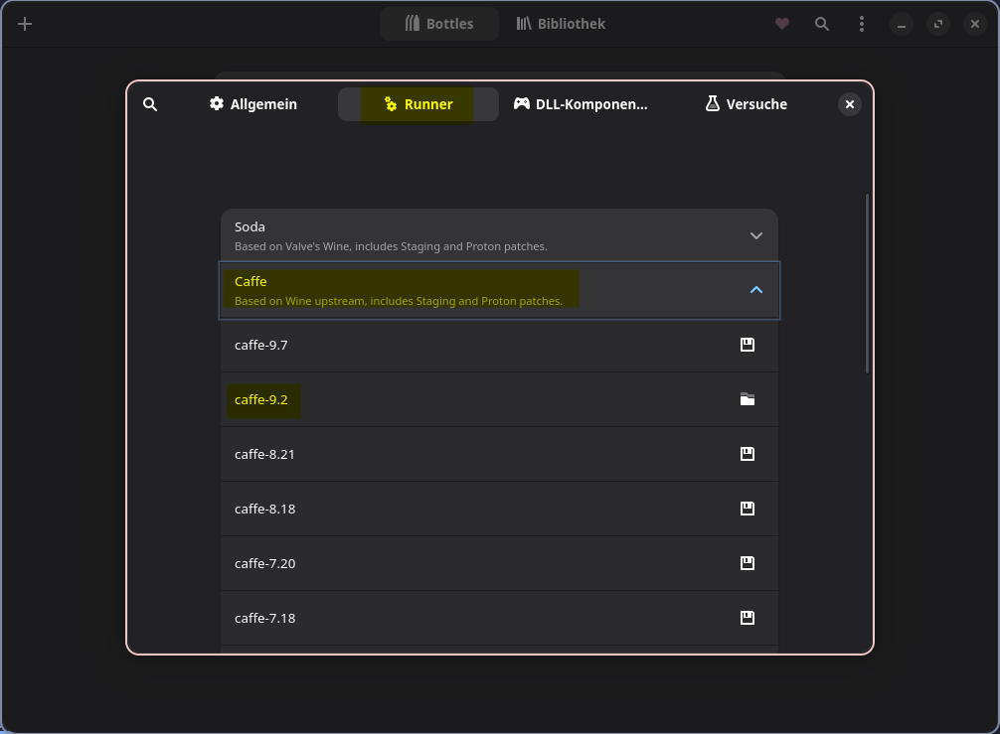
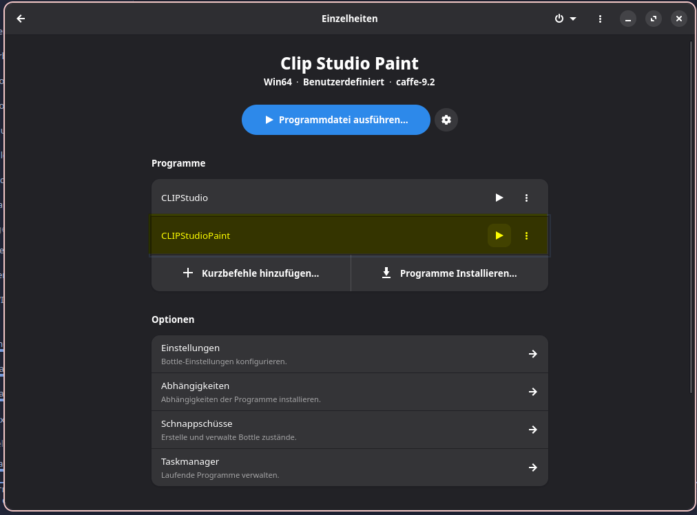

# How to install and use Clip Studio Paint on Linux (using Bottles)

<a href="#the-tldr-guide">I know my way around Linux, take me to the TL;DR</a>

For everyone just getting started with Linux, this guide is for you. CSP version 1.13.2 will work pretty much flawlessly using this method, for later versions your mileage may vary.

## Preamble

More and more people are growing tired of Microsoft’s approach to Windows and the additions to the aforementioned operating system. Whatever may have broken the camel’s back – in my case it was Recall, a „feature“ that takes screenshots of everything you do every couple seconds – you, the person reading this, are looking for an alternative to Windows. Chances are you’ve already done some research and landed on Linux as a replacement. Whichever distro you may choose, you’re probably also painfully aware that some applications you like using do not have a native Linux port. If you are an artist relying on Clip Studio Paint, you’re probably hesitant to make the switch, as Celsys does not offer a Linux version of their software. While this may be annoying, there are ways to make Clip Studio Paint work on any Linux distribution, one of which I’ve personally found very reliable, easy to set up and, most importantly, stable. In this guide I will walk you through the steps of setting up your copy of Clip Studio Paint on any Linux distribution.

This guide will rely almost exclusively on GUI programs (meaning applications that offer a graphical user interface) and very little on typing commands in a terminal, so even if you’re a complete newcomer to Linux, you don’t have to be scared of the CLI (Command-line interface). If a step requires you to use the terminal, I will format the necessary commands as such:

`I am a placeholder terminal command!`

With all that out of the way, let’s begin installing Clip Studio Paint!

## Prerequisites

First, we have to check a few things. And by few, I mean just one: Is Flatpak installed on your system?

Most distros these days ship with Flatpak preinstalled. If you’re not sure whether it’s already up and running, you can (and should) open your terminal and type the following command:

`whereis flatpak`

If this command returns a file path, congratulations, Flatpak is up and running, you can safely skip to the next part. If not, you’ll have to install Flatpak. To do that, just type the following into your terminal (depending on your chosen distro) and confirm the command with your user password afterwards.

**Debian/Ubuntu based distros** (such as Linux Mint, Ubuntu, POP!_OS)

`sudo apt install flatpak`

**Fedora/Fedora based distros** (such as Nobara)

`sudo dnf install flatpak`

**Arch/Arch based distros** (such as CachyOS, EndeavourOS, Manjaro)

`sudo pacman -S flatpak`

Once you have installed Flatpak (or confirmed it’s already in place), we can head to our desktop environment’s “App Store” and search for an application called “Bottles” as well as “Flatseal”. The latter will only come into play if you intend to keep your CSP files on a secondary drive, so we’ll come back to Flatseal later.

You’ll also want to download the Windows installation package of Clip Studio Paint from <a href="https://www.clipstudio.net/en/dl/">their website</a> and have your login credentials or serial number ready for later.

Once all that is out of the way, open the application Bottles.

## Setting up Bottles

Once inside Bottles, you’re greeted with a short tour. Skip through it. Click on the three dots in the upper right corner and head to **Preferences**. Click on **Runners**, open the section called **Caffe** and download **caffe-9.2**. Wait for the download to finish, then close the settings menu and click on the plus sign in the upper left corner of Bottles.

We’ll now create a new Bottle. Think of a Bottle as a mini installation of Windows. Don’t worry, we won’t have to deal with Microsoft’s shenanigans, the Windows instance is very minimal and will only affect the programs we run within it.
Give your Bottle a catchy name such as “Clip Studio” so you’ll remember what’s in it. Then, select **Custom** and for our runner, we’ll select our previously downloaded **caffe-9.2** in the dropdown menu. Click on **Create** and wait for the Bottle to be created. Click close once it’s done, then click on the Bottle you just created.

In the next menu, we’ll have to apply a few settings and download some dependencies. First, click on **Settings**, then scroll down to the section **Compatability** and select **Windows 8.1** in the **Windows version** dropdown menu. Everything else can stay the way it is, so let’s go back to the previous screen.

Now, just underneath Settings, we’ll click on **Dependencies**. In that list, you’ll want to download the following:

- allfonts
- gecko
- mono
- vcredist2022

Now we’re ready to install Clip Studio. We’re almost there!

## Installing Clip Studio Paint

Time for the main event. Click on **Run Executable** and select the **Clip Studio installer file** that you downloaded earlier. The installation popup should appear just as it would on Windows. Click through the setup as you normally would (**don’t change the install directory**) and wait for it to finish. Close the window once it’s done installing.

You should notice that there is now a new entry in the Bottles menu called “**CLIPStudio**”. Click on the **play button** next to it to launch the CSP launcher. If you already have a license, you should be able to activate it within the launcher, BUT launching CSP itself through this launcher will unfortunately not work. However, there is an easy workaround for that.

Close out of the launcher again and click on **Add Shortcuts** just below the launcher entry. A file manager window should pop up. Now, navigate the folders as such: *drive_c > Program Files > CELSYS > CLIP STUDIO 1.5 (or whatever the case may be for you) > CLIP STUDIO PAINT*. In that folder, select “**CLIPStudioPaint.exe**” and hit “**Add**”.

You now have a direct shortcut to Clip Studio Paint in your Bottles menu. Click on the Play button next to it, and …. we’re in! Go ahead and test all of its functionality, but we should be done for the most part now. If you want easier access to Clip Studio, you can also add a shortcut to your Desktop environment's application launcher/start menu by clicking on the three dots next to the play button and select “**Create Desktop Shortcut**”. And there you go. Clip Studio is now running on Linux!

One last thing: **In case your tablet’s pressure isn’t working**, in Clip Studio Paint, head to **File > Preferences** and under **Tablet**, enable the checkbox “**Use mouse mode in tablet driver settings**”. After that, your tablet should work just fine.

## A note on Flatseal

Now, you might remember that I had listed **Flatseal** as a prerequisite. That’s due to the very nature of Flatpak apps: They basically run inside their own containers, so by default they don’t have access to your whole system. While that’s a great security feature, it can get in the way of functionality.

You can give Flatpak apps permission to access stuff outside of their containers using either CLI commands or – more conveniently – with **Flatseal**. So if you intend to save your CSP files on **external  or secondary drives within your computer**, open Flatseal, select Bottles in the list to the left and scroll down until you find a section called “**Other Files**”. Click on the Folder icon to the right and type in (or copy/paste) the path to the location you need for your work. Once that’s done, Bottles should have those permissions next time you open it or Clip Studio Paint again.

I’d be remiss not to mention that you can also give CSP direct access to your files within its open and save dialog as follows: Open Bottles, click on your CSP bottle and open *Settings* again. Once again, scroll down until you find the **Compatability** section, then click on **Manage Drives**. In the following popup, choose a drive letter, click on the check mark next to it, then – in the list below – find the drive letter you just created and **assign to it the drive or file path you want to give CSP access to**. Now you should be able to navigate to that location (and all of the folders within it) using CSP’s open and save dialogs.

And that’s pretty much it! If you run into any issues or suggestions on how to improve this guide, <a href="https://bsky.app/profile/pomcomic.bsky.social">feel free to ask me on Bluesky</a>. Hope this helped. Happy painting!

## The TL;DR guide

- Install Bottles (Flatpak recommended)
- In Bottles, download caffe-9.2 runner
- Create new custom bottle, select caffe-9.2 runner
- In Settings, select Windows version 8.1
- Download dependencies: allfonts, gecko, mono, vcredist2022
- Install Clip Studio Paint
- Add Shortcut: drive_c > Program Files > CELSYS > CLIP STUDIO 1.5 (or whatever the case may be for you) > CLIP STUDIO PAINT > CLIPStudioPaint.exe
- Launch Clip Studio Paint directly (skip the CSP launcher)
- To fix pen pressure: In CSP, go to File > Preferences > Tablet, enable “Use mouse mode in tablet driver settings”
